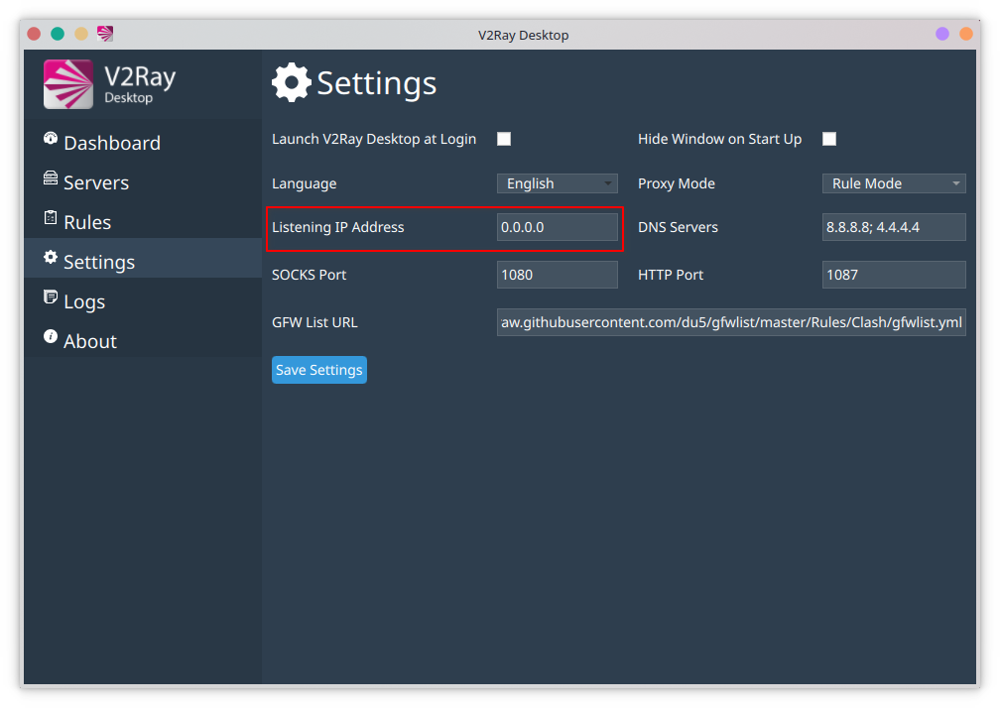
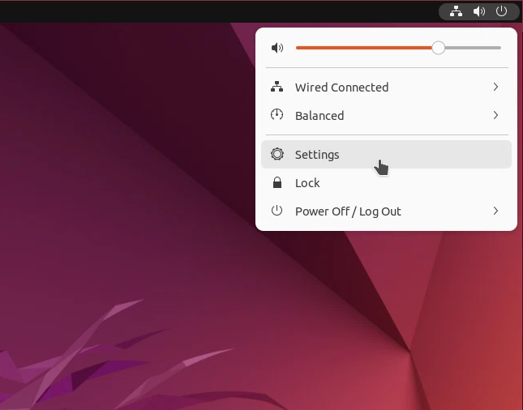
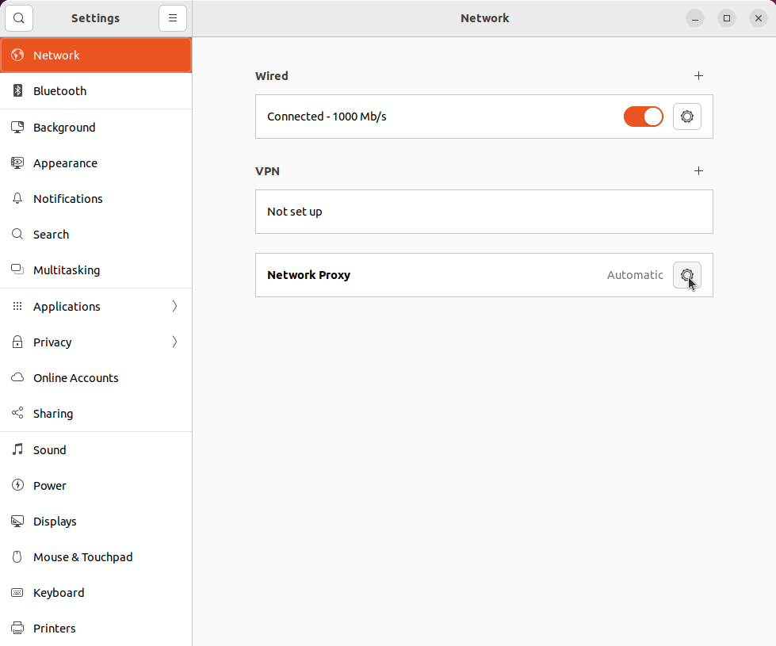
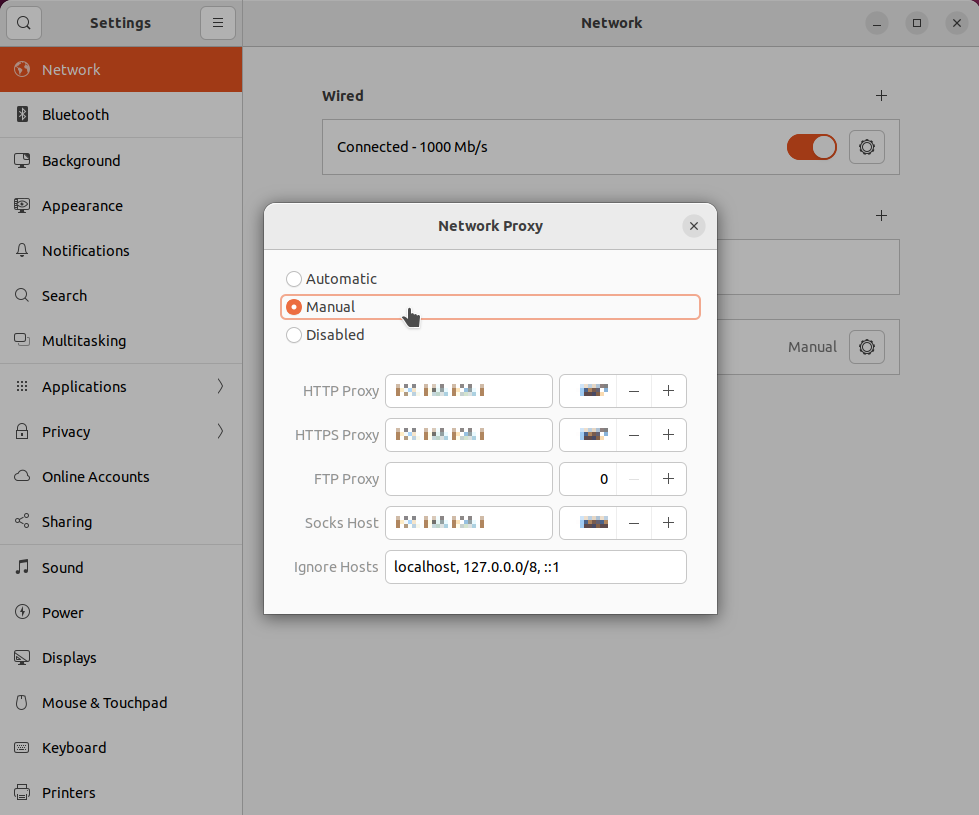
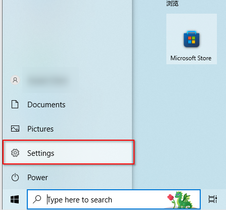
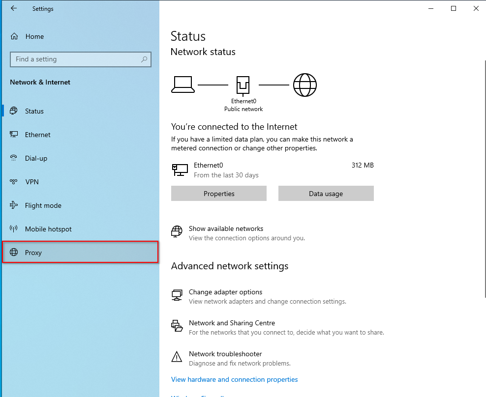
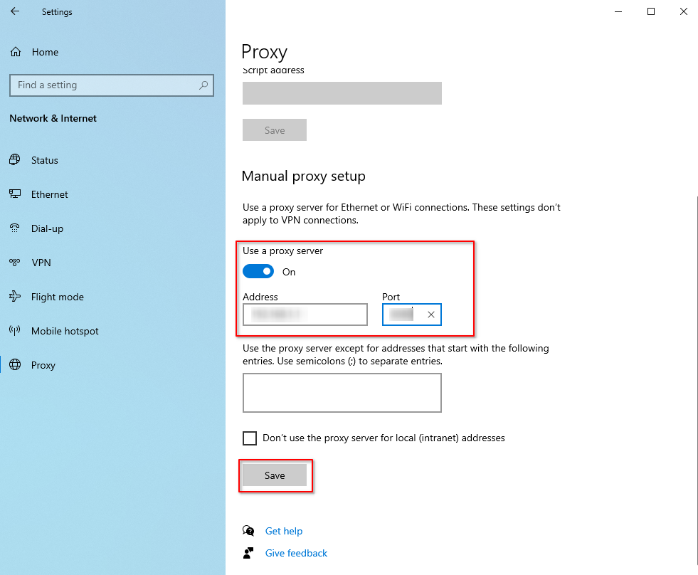

<!-- vimc: call SyntaxRange#Include('```bat', '```', 'dosbatch', 'NonText'): -->

# Proxy Guideline

If you're using OSWorld behind a GFW, you can configure your VM to use proxy
following the steps below.

#### 1. Configure Your Proxy on the Host Machine

By default, proxy software usually listens only to the local loopback address
(`127.0.0.1`), which cannot be reached from other machine (including the
virtual machine). Hence, firstly make your local proxy software listen to the
IP address of the VMWare network card, or simply `0.0.0.0` for all the IP
addresses. The VMWare network card are usually named `vmnetX` like `vmnet8`.
Make sure to use the IP address within the identical network segment.  For
example, `192.168.108.1/24` and `192.268.108.130/24` are within the same
network segment, *i.e.*, the same subnet mask (24) and the same prefix
(`192.168.108`, 24-bit length). Usually, different VM instances share the same
network segment, and so, the effective host IPs are the same.

 After launching the VM, you can use

```sh
# run this command on host
# change ws to fusion if you use VMWare Fusion
vmrun -T ws getGuestIPAddress /path/to/vmx/file
```

to get the IP of the VM. As for host IPs, on Ubuntu (Linux) machine, you can
use `ip a` command to check the IP addresses of each network card. On Windows
machine, you can use `ipconfig` command to check the IP addresses of each
network card. Recognize the correct IP and note it for later use.

Then you should configure the listening address of your proxy software:



If you cannot change the listening address of your proxy software, you can set
up port forwarding. Suppose your proxy software is listening to 1080 port of
localhost (`127.0.0.1`), and the effective host IP address is `192.168.108.1`.
On Ubuntu (Linux), you can use `socat` to forward `192.168.108.1:1080` to
`127.0.0.1:1080`:

```sh
socat TCP-LISTEN:1080,bind=192.168.108.1,fork TCP:127.0.0.1:1080
```

On Windows, if you have administrative privilidge, you can simply run the
following command in a `cmd` window with admin privilidge.

```bat
netsh interface portproxy add v4tov4 listenaddress=192.168.108.1 listenport=1080 connectaddress=127.0.0.1 connectport=1080
```

Or if you haven't got administrative privilidge, you can use `ncat` bundled in
[Nmap](https://nmap.org) to forword the port:

```bat
ncat -k -l 192.168.108.1 1080 --sh-exec 'ncat 127.0.0.1 1080'
```

#### 2. Configure in the VM Machine

##### For the Ubuntu Image

###### Configuration by GUI

Open system network setting in the VM.





Then, click on "Network Proxy".



Set an appropriate proxy mode. Usually, use "Manual" mode, and set the correct
IP addresses and ports. The IP address should be the host machine IP noted in
the previous step.

Then you can open a chrome page to check if the proxy works well.

###### Configuration by Command Line

If configuration by GUI is not suitable for you, you can instead execute the
following commands in the VM to configure proxy on the Ubuntu image:

```sh
# run these command in the VM
gsettings set org.gnome.system.proxy mode 'manual'
gsettings set org.gnome.system.proxy.http host 'xxx.xxx.xxx.xxx'
gsettings set org.gnome.system.proxy.http port xxxx
gsettings set org.gnome.system.proxy.https host 'xxx.xxx.xxx.xxx'
gsettings set org.gnome.system.proxy.https port xxxx
gsettings set org.gnome.system.proxy.socks host 'xxx.xxx.xxx.xxx'
gsettings set org.gnome.system.proxy.socks port xxxx
```

If there isn't a physical or virtual screen available for you to direct operate
on the VM, you can run these commands with the help of `vmrun`. For instance,

```sh
# run this command on host
# change ws to fusion if you use VMWare Fusion
vmrun -T ws runProgramInGuest /path/to/vmx/file /usr/bin/gsettings set org.gnome.system.proxy mode 'manual'
```

##### For Window Image

###### Configuration by GUI

Open system network setting in the VM.




Then, click on "Proxy".



Switch on "Use a proxy server" and type in the correct proxy configurations.



Finally, remember to click on "Save".

Note that only HTTP proxy is supported.  Subsequently, you can open a chrome
page to check if the proxy works well.

<!--
###### Configuration by Command Line

If configuration by GUI is not suitable for you, you can instead execute the
following commands in the VM to configure an HTTP proxy on the Windows image:

```bat
:: run this command in the VM
netsh winhttp set proxy proxy-server="xxx.xxx.xxx.xxx:yyyy"
```

Remember to execute this command in a cmd window with administrative
privilidge.

If there isn't a physical or virtual screen available for you to direct operate
on the VM, you can run these commands with the help of `vmrun`. For instance,

```sh
# run this command on host
# change ws to fusion if you use VMWare Fusion
vmrun -T ws runProgramInGuest /path/to/vmx/file # TODO
```
-->

<!-- TODO: add remind of new snapshot -->

#### 3. Create a New Snapshot

After modifying the virtual machine, remember to create a new snapshot and
start from this new snapshot at experiments.

```sh
# change ws to fusion if you use VMWare Fusion
vmrun -T ws snapshot /path/to/vmx/file snapshot_name
```

```python
env = DesktopEnv(snapshot_name="snapshot_name")
```
